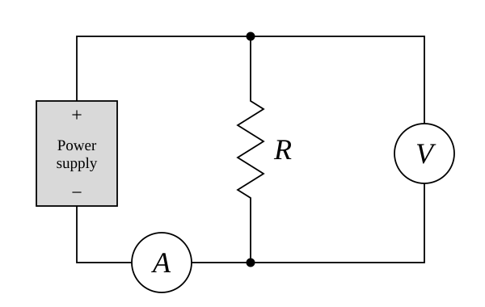
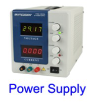
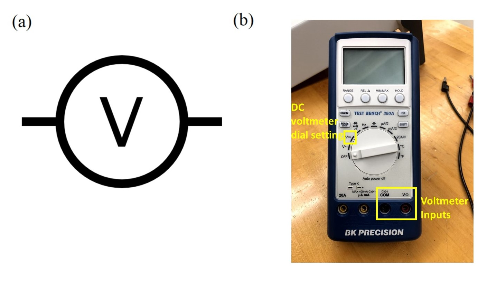

# Measuring a Resistance

This hands-on activity is a warm-up for the Graphing and Fitting Lesson.  You will collect a small data set, plot it and fit a line to it in Google Sheets, and then take a critical look at what Google Sheets can and cannot tell you about your fit.  The whole activity should take about 45 minutes.

## Goals for This Activity

Your goals for this activity are to become familiar with a simple circuit and the data-taking process, measure how the current through a resistor depends on the voltage across it, and use a fit to your data to determine the resistance $$R$$ of the resistor.  At the end of this activity, you should be able to quote your experimentally determined $$R \pm \delta R$$.

First you will set up a circuit to connect a power supply to a single resistor, while including multimeters to measure the current through the resistor and voltage across the resistor.  You will collect data by varying the voltage and plot $$I$$ vs. $$V$$ for your resistor in Google Sheets, with error bars.  You will fit a line to your data and determine $$R \pm \delta R$$ from the slope of the line.  You will also use the intercept of the line and its uncertainty to check for a systematic offset in your measurements.

Next, you will consider what would happen if your error bars were not all the same.  That question is the starting point for the rest of the Graphing and Fitting Lesson.

## Background

Some basic circuit vocabulary will be useful for this activity.  A power supply is used as the power source for a complete circuit, or loop, in which electrons can flow from the source through a device or **_load_** and then back to the source, as sketched in the figure below:

Above we see a simple electrical circuit on the right, with a resistor of resistance $$R$$ acting as the load.  On the left is a sketch of a more tangible analogy: a water circuit in which a pump pushes water around a loop where the water gives up energy getting through an obstruction before returning to be pumped again.

The amount of **electrical charge flowing past a point in a circuit per unit time is called _current_, and traditionally denoted by the variable $$I$$.**  Likewise, **the energy change per electrical charge between two points in a circuit -- in this case, before and after the resistor -- is called _voltage_, and traditionally denoted by the variable $$V$$.**  We measure current in standard units of **_amperes_ or amps (A)**, and voltage in standard units of **_volts_ (V)**.

In the electrical circuit above, the load is characterized by its electrical **_resistance_, denoted by the variable $$R$$ and measured in standard units of ohms ($$\Omega$$).**  A small resistance means that the load does little to obstruct the flow of electrons, so a given voltage will produce a large current.  Conversely, a large resistance will restrict the flow of electrons, so the same voltage will produce a smaller current.  For a resistor, the relationship between current and voltage is a simple one, known as Ohm's law:
\begin{equation}\label{eq:ohm}
I = \frac{V}{R}.
\end{equation}
The theory therefore suggests that $$I$$ and $$V$$ should be directly proportional: a graph of $$I$$ vs. $$V$$ for a resistor should be a straight line with a slope of $$1/R$$ and an intercept of zero.

## Instrumentation

Using cables available at your station, connect your power supply to a resistor along with an _ammeter_ to measure current and a _voltmeter_ to measure voltage.  The circuit you should create is shown schematically below, but we will also go one-by-one through the circuit symbols and the actual pieces of equipment they represent.

The figure above shows the circuit schematic for measuring $$I$$ vs. $$V$$ for a resistor.  The power supply is shown as a gray rectangle.  A voltmeter measures the voltage across the resistor, and an ammeter measures the current flowing through the resistor.

Safety Warning: Whenever you are connecting elements in a circuit, make sure the power supply is off. Do not turn on the power supply until you have completed the circuit.

Your power source is the same **power supply** you used in Module 1:

With the power supply turned off, turn all its front-panel knobs completely to the left (counter-clockwise) to ensure there is no voltage or current being supplied.

The load in your circuit is a single **resistor** with a resistance of approximately 1 k$$\Omega$$ (1000 $$\Omega$$).  The resistor has a bare wire lead at each end, and you will connect it to the rest of your circuit with alligator clips: attach one alligator clip to each lead of the resistor.

<!-- TODO: add a photo of the resistor held in alligator clips, e.g.

-->

By convention red and black denote places current will flow from and to, respectively, so you should connect the red positive (+) output of the power supply to one side of the resistor, following the circuit schematic at the beginning of this section.

Safety Tip: Never touch the two leads of the power supply together! This will short-circuit the power supply and could damage it.  In this circuit, that means making sure the alligator clips on the two sides of your resistor do not touch each other.

For the voltmeter and ammeter in your circuit, you will use two different _digital multimeters_, instruments that can be set to measure a variety of electrical properties of a circuit or individual device.

To measure current, you will use the desktop multimeter pictured below:

Part (a) above shows the circuit schematic symbol for an ammeter, while part (b) shows the instrument you will use.  Power on the multimeter and press the "Shift" and "DC V" buttons to set it to measure DC current (see blue "DC I" above the "DC V" button).  There are two red current ports labeled with the max amount of current they can measure:  500 mA and 20 A.  It is generally good practice to start out using the 20A (higher-current) port if you do not know what current to expect.  In this activity, however, you can predict the current: a voltage of 10 V across a resistance of approximately 1 k$$\Omega$$ should produce a current of only about 10 mA.  You should therefore use the 500 mA port for greater sensitivity.  Current coming from the resistor should be connected to the red 500 mA input of the ammeter.  Current will then flow through the ammeter and out the black COM port, which should be connected to the black negative (–) output of the power supply to complete your circuit.

This is a good time to set up your circuit with the power supply, resistor, and ammeter all in a single loop (_in series_ with each other) so current flows through each in turn.

The last component you will add is your voltmeter.  For this purpose you will use a handheld multimeter like the one pictured below:

Part (a) above shows the circuit schematic symbol for a voltmeter, while part (b) shows the instrument you will use.  Power on the voltmeter by turning the dial to measure DC voltage, as indicated in the picture.  Since voltage is the energy change per unit charge in going from one point in a circuit to another, a voltmeter must be connected to two different points on the outside of an already complete circuit loop.  This is called connecting it _in parallel_ with the rest of the circuit.  You will connect your voltmeter leads to the two sides of your resistor, one to each of its wire leads.

<!-- TODO: add a photo of the voltmeter leads connected across the resistor, e.g.

-->

Now turn on the power supply.  The light labeled C.V. should be green, meaning that the output of the power supply is limited by the voltage dial settings.  Turn the coarse dial for the voltage slowly up (clockwise).  If the green C.V. light goes off and the red C.C. light goes on, the power supply output is now being limited by the current dial settings, and the voltage will stop rising in response to further increases of the coarse voltage dial.  Turn the coarse current dial up slightly until the green C.V. light comes back on.  **Do not exceed 12 V. Keep an eye on how much current the power supply is providing. If it goes above 20 mA (0.020 A), turn it down immediately** and check your circuit or ask an instructor.

Make sure the ammeter is reading a current (in units of A or mA) and your voltmeter is reading a voltage (in units of V or mV).  Be aware that either of your meters may autoscale as the current and voltage values change; make sure to pay attention to the units on the displays so that you are recording current and voltage accurately.  After it has been powered on for a long time, the voltmeter might beep and possibly turn itself off, but you can always just turn the dial to off and then back to DC volts.

## Data Collection

With your circuit complete and both meters powered on and set correctly, now you will measure $$I$$ vs. $$V$$ for your resistor.  Use the voltage dials on the power supply to bring the voltage across your resistor to approximately 2 V, 4 V, 6 V, 8 V, and 10 V in turn.  There is no need to land on these voltages exactly.  At each of the five settings, record the voltage $$V$$ from your voltmeter and the current $$I$$ from your ammeter, including every digit that each meter displays.  (The displays on the front panel of the power supply are useful for setting the voltage, but your multimeters measure what is happening at the resistor itself.)

Record your data in a Google Sheet, arranged with x-axis values ($$V$$) in one column, y-axis values ($$I$$) in another, and y-axis uncertainties ($$\delta I$$) in a third.  The first row must hold labels, including units: for example, V (V), I (mA), and δI (mA).

What should go in the uncertainty column?  For now, we will just worry about one source of uncertainty: the resolution uncertainty of your current measurement.  (Your voltage measurement has a resolution uncertainty too, but we will set it aside for now.)  As discussed in [Understanding Uncertainty](DAG_uncertainty-introduction#resolution-uncertainty), a good estimate of resolution uncertainty is the smallest increment that can be measured divided by $$\sqrt{12}$$.  For a digital meter, the smallest increment is one unit of the last digit on the display.  For example, if your ammeter reads 4.012 mA, the smallest increment it can measure is 0.001 mA, so $$\delta I = (0.001 \text{ mA})/\sqrt{12} \approx 0.0003$$ mA.  In Google Sheets you could calculate this by entering **=0.001/SQRT(12)**.

If the resolution of your ammeter is the same for every reading, all five of your data points have the same uncertainty.  But remember that your ammeter may autoscale: if some of your readings show fewer digits after the decimal point than others, make a note of which ones.  For now, use the largest of your $$\delta I$$ values for all five data points.  We will come back to this at the end of the activity.

Your data collection should be complete about 20 minutes into the activity.

## Plotting Your Data in Google Sheets

To help you see the trend in your data, make a scatter chart of $$I$$ vs. $$V$$ in your Google Sheet:

1. Select your $$V$$ and $$I$$ columns, including the labels in Row 1.  Go to the "Insert" menu and select "Chart".  A chart will appear in your sheet, along with a "Chart editor" panel on the right side of the window.  (If you close the Chart editor, you can double-click your chart to open it again.)

2. Under "Setup" in the Chart editor, find "Chart type" and select "Scatter chart".  Check that your $$V$$ column is listed under "X-axis" and your $$I$$ column is listed under "Series".

3. Under "Customize" in the Chart editor, open "Chart & axis titles" and make sure both axes are labeled with the quantity plotted and its units.

4. Still under "Customize", open "Series" and check the box next to "Error bars".  Set "Type" to "Constant" and enter your value of $$\delta I$$ under "Value".

For more instructions on how to make the scatter chart and add error bars, see [here](https://support.google.com/docs/answer/9143294){:target="_blank"} and [here](https://support.google.com/docs/answer/9085344){:target="_blank"}, or talk to a classmate or instructor.

Do not worry if you cannot see your error bars.  The resolution uncertainty of your ammeter is a tiny fraction of the currents you measured, so your error bars are probably hidden behind your data points.

## Fitting a Line in Google Sheets

Now you will fit a straight line, $$I = mV + b$$, to your data.  Both the slope $$m$$ and the intercept $$b$$ will be free parameters determined by the data; we are not forcing the line to pass through the origin.

1. To draw the best-fit line on your chart, go to "Customize" and "Series" in the Chart editor and check the box next to "Trendline".  Leave "Type" set to "Linear", and under "Label" select "Use Equation".  The line and its equation will appear on your chart.  Notice that the trendline gives you a slope and an intercept, but no uncertainty for either one.

2. To get uncertainties in the slope and intercept, use the Google Sheets function LINEST.  Click on an empty cell that has an empty column to its right and four empty rows below it, and enter **=LINEST(B2:B6, A2:A6, TRUE, TRUE)**.  Here B2:B6 are the cells holding your $$I$$ values and A2:A6 are the cells holding your $$V$$ values; adjust these to match your own sheet.  The first TRUE tells Google Sheets to let the intercept be a free parameter, and the second TRUE asks it to report more than just the slope and intercept.

The output of LINEST fills a block of cells two columns wide and five rows tall.  The first two rows are the ones you need:

|  | Left column | Right column |
|:--|:--|:--|
| **Row 1** | slope, $$m$$ | intercept, $$b$$ |
| **Row 2** | uncertainty in slope, $$\delta m$$ | uncertainty in intercept, $$\delta b$$ |

Check that the slope and intercept from LINEST match the equation of the trendline on your chart.

#### Finding the resistance

From Eq. \eqref{eq:ohm}, the slope of your line is $$m = 1/R$$, so you can calculate the resistance as $$R = 1/m$$.  Pay attention to units: if you plotted $$I$$ in mA and $$V$$ in V, then $$m$$ has units of mA/V and $$1/m$$ is a resistance in k$$\Omega$$.  To find the uncertainty $$\delta R$$, use the [error propagation](DAG_error-propagation) rule for functions of a single variable:
\begin{equation}
\delta R = \delta m \Bigl\lvert\frac{dR}{dm}\Bigr\rvert = \frac{\delta m}{m^2}.
\end{equation}
Calculate $$R \pm \delta R$$ in your Google Sheet, and write down your final result following the guidelines for [significant figures](DAG_significant-figures).  Is your result reasonable, given that your resistor has a resistance of approximately 1 k$$\Omega$$?

#### Checking for a systematic offset

According to Eq. \eqref{eq:ohm}, no current should flow when the voltage is zero, so the theory suggests an intercept of $$b = 0$$.  But consider what might happen if you had a systematic error that shifted all of your measured $$I$$ values -- for example, an ammeter that reads a small current even when no current is flowing.  Individual $$V/I$$ values would all be influenced by such an error, but fitting a line would give you the correct slope plus a non-zero intercept.  This is why we let the intercept be a free parameter in the fit.

Compare your intercept $$b$$ to its uncertainty $$\delta b$$.  If $$b$$ is no more than one or two times $$\delta b$$ away from zero, the difference between your intercept and zero is within the uncertainty of the fit, and you have no evidence of a systematic offset.  If $$b$$ is many times $$\delta b$$ away from zero, then something is shifting your measurements, and it is worth thinking about what that might be.

## What If the Error Bars Are Not All the Same?

In this activity every data point had the same error bar, because the only uncertainty we considered was the resolution of your ammeter.  That will not usually be the case: we often measure data points that have different uncertainties.  In fact, it could easily have happened here.  If your ammeter autoscaled between your smallest and largest currents, then some of your readings were displayed with one fewer digit after the decimal point -- and so had a resolution uncertainty ten times larger -- than others.

Discuss the following questions with your lab partner.  Your instructor may ask each group to share its ideas with the class.

+ Suppose the error bars on your two largest currents were ten times larger than the error bars on your other three data points.  Because the uncertainties represent how confident we are about our measured values, should all five data points have an equal say in determining the best-fit line?  How would you want a fit to treat them?

+ How would you show two different sizes of error bar on your Google Sheets chart?  (Take another look at the options under "Error bars" in the Chart editor.)

+ Change the "Value" of your error bars in the Chart editor to something much larger (for example, 0.5 if your currents are in mA), so that you can see the error bars clearly.  What happens to the trendline and to the output of LINEST?  What does this tell you about how Google Sheets used your error bars in the fit?  (Change the value back when you are done.)

+ If the fit did not use your error bars, where do you think the uncertainties $$\delta m$$ and $$\delta b$$ reported by LINEST came from?

+ In a good fit, we expect to find that each data point is about one error bar away, on average, from the fitted line.  Is that true for your data?  Can you tell from your chart, or from anything Google Sheets has reported?

 (think about it first, then click to expand/collapse) 
  What you should have found: 

Google Sheets will draw your error bars, but it does not use them:

1. The trendline and LINEST treat all data points equally (i.e. an "unweighted" fit).  Changing the size of the error bars changes nothing about the fit.  And because Google Sheets applies a single error bar setting to all the data points in a series, there is no simple way even to draw error bars that differ from one data point to the next.

2. The uncertainties in the slope and intercept reported by LINEST are determined only from how scattered the data are about the fit line.  They do not take your error bars into account.

3. Google Sheets does not give us a relevant measurement of how good the fit is.  It can report a quantity called $$R^2$$, but $$R^2$$ does not compare the distance of each data point from the line to the size of its error bar.  And when the variation of data away from the fit line is too small to see on the chart, you cannot make that comparison by eye either.

**When the error bars aren't all the same, we want to use a weighted least-squares fit.**  A weighted fit takes into account your confidence (uncertainty) in each individual data point.  For example, a data point with 1% uncertainty will be given more importance than one with 10% uncertainty.  Google Sheets has no simple way to do this, so we need to use a more sophisticated program.

For the rest of Physics 50 you will make use of the plotting and fitting routine on the [Physics 50 Fitting Page](https://physics.hmc.edu/fitter/){:target="_blank"}.  It performs a weighted fit and provides what Google Sheets could not: an estimate of the uncertainty for each of the fit parameters that takes your error bars into account, a plot of residuals, and two measurements of how good the fit is, the reduced chi-squared $$\chi_\nu^2$$ and $$P_>$$.

The rest of the Graphing and Fitting Lesson explains [why and how we use a weighted fit](DAG_curve-fitting-motivation), [how to use the plotting and fitting routine](DAG_plotting-guide), and [how to interpret its results](DAG_interpreting-plots).  Hold on to your Google Sheet from this activity: your data is already arranged in the three columns that the fitting routine needs.

[Return to Data Analysis Main Page](data_analysis_guides) 
-----------
