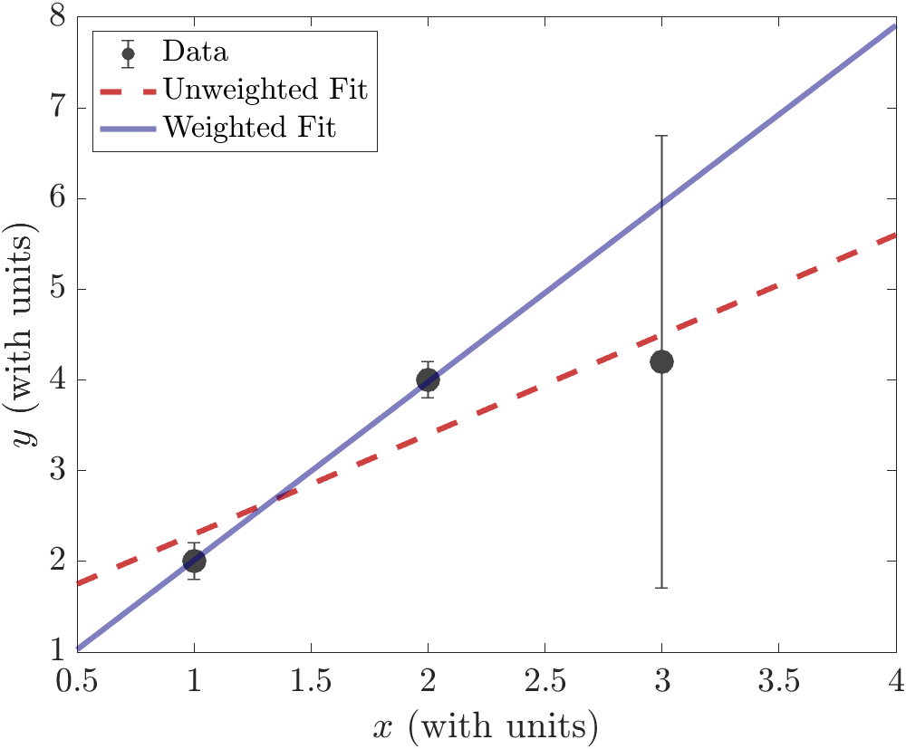

# Curve Fitting

The process of fitting a theoretical function to data is an important skill for all experimental scientists to master, and in Physics 50 we are laying a foundation for this skill. 

## Linear Fitting Introduction

**Why can't I just use the "trendline" feature in Excel or Google Sheets?**

Spreadsheet software has a built-in features to fit data, and it would be wonderful if we could use those. But the built-in fitting for Excel (or Google Sheets) falls short in a few important ways:

1. Excel treats all data points equally (i.e. an "unweighted" fit)
2. Excel doesn't give us an uncertainty in the slope and intercept
3. Excel doesn't give us a relevant measurement of how good the fit is

#### 1. Unweighted vs. Weighted Fit

Suppose we are fitting a set of $$n$$ data points $$\{(x_1,y_1), (x_2,y_2), \ldots, (x_n,y_n)\}$$ to a straight line $$y(x) = mx + b$$. The "trendline" function in Excel will perform an unweighted least squares fit by finding the values of $$m$$ and $$b$$ that minimize the distance between the data and fit line. In mathematical language (if that's something you're into),  we are finding $$m$$ and $$b$$ that satisfy
\begin{equation}\label{eq:unweighted}
\underset{m,b}{\mathrm{argmin}} \sum_{i=1}^{n} (y_i - (mx_i+b))^2
\end{equation}
If you look at that sum, each term is the squared difference in height, on a $$y$$ vs. $$x$$ plot, between the actual measured value $$y_i$$, and the predicted value $$mx_i +b$$ from the linear fit. So by adjusting the values of the parameters $$m$$ and $$b$$, this type of fitting minimizes the difference between the measured values and the predicted values.

For example, if we have three data points $$(x_1,y_1)$$, $$(x_2,y_2)$$, $$(x_3,y_3)$$, an unweighted fit to those data points would minimize the total squared distance between the data and the fitted line.
 

In the plot above, the fitting procedure adjusts the values of $$m$$ and $$b$$ to minimize the sum of the squared lengths of the red lines.

One shortcoming of the unweighted least squares fit of Eq. \eqref{eq:unweighted} is that it treats all data points equally, even ones with really big error bars. We often measure data points that have different uncertainties. Because the uncertainties represent how confident we are about our measured values, we should take into account our relative confidence about each data point.

For example, let's look at those same three data points, but where each $$y_i$$ has a corresponding uncertainty $$\delta y_i$$. In this example, let's make the uncertainty in the third data point much larger than the other two:

An unweighted fit (red, dashed line) treats all three of those data points equally. Although this fit line is "close" to all three data points, it doesn't account for the fact that some data points are more reliable than others. That's because the unweighted fit doesn't take into account the extra information we have about the uncertainty in the data. 

**When the error bars aren't all the same, we want to use a weighted least-squares fit.** In a weighted least-squares fit, the minimization is performed in a slightly different way than Eq. \eqref{eq:unweighted}. The difference between data and the fit line is divided by the error bar (uncertainty) for each point. In the fit we determine the values of $$m$$ and $$b$$ that minimize the quantity 
\begin{equation}\label{eq:weighted}
\chi^2 = \underset{m,b}{\mathrm{min}} \sum_{i=1}^{n} \left(\frac{y_i - (mx_i+b)}{\delta y_i}\right)^2
\end{equation}
Here, $$\chi$$ is the Greek letter "chi" (pronounced like ["Kai"](https://www.marketplace.org/2020/10/01/canadas-tourist-driven-pne-pivots-to-hosting-film-production/){:target="_blank"}).

Performing a weighted least-squares fit on the example data above, we get the solid blue line. When we do a weighted least-squares fit, we expect to find that **each data point is about one error bar away, on average, from the fitted line.**