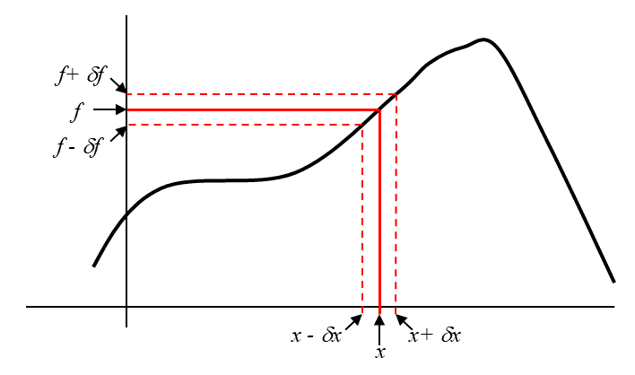
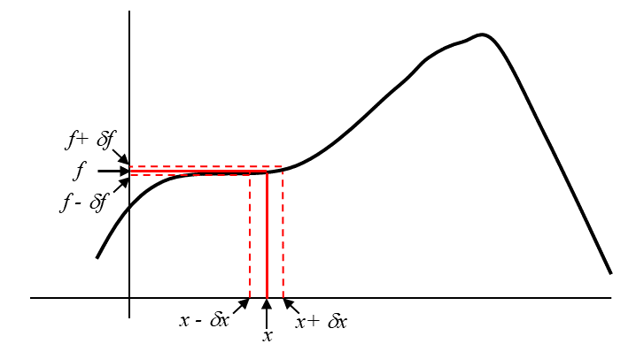

# Error Propagation

- [Functions of a Single Measured Quantity](#functions-of-a-single-measured-quantity)
- [Functions of Several Measured Quantities](#functions-of-several-measured-quantities)

## Functions of a Single Measured Quantity

In the [uncertainty introduction](uncertainty-introduction), we discussed methods for finding the uncertainty for a direct measurement.  Often, however, we must do some calculations with our raw data to arrive at the result we are actually interested in.  Turning an uncertainty in a measured quantity into the uncertainty it causes in a calculated result is called **_error propagation_**.  There is really only one basic formula that governs error propagation, and we will develop it right now.
	
Suppose we have a quantity, $$x$$, which we can measure directly with uncertainty $$\delta x$$.  There is a function $$f(x)$$ whose value we are interested in knowing.  Being uncertain about $$x$$ will clearly cause some uncertainty in $$f$$, so we will call this uncertainty $$\delta f$$. The sketched graph below may give us some inspiration about how to calculate $$\delta f$$:

From the sketch above, it is tempting to suggest a simple rule like $$\delta f = \delta x$$.  But this is almost certainly flawed:  what if $$f$$ and $$x$$ don't even have the same units?  To get a better idea of the correct relationship, consider a second sketch:

In the second sketch, $$\delta f$$ is clearly much smaller than in the first sketch, even though $$\delta x$$ is exactly the same in both cases.  Why?  Because the function $$f(x)$$ is flat, or very nearly so, near the value of $$x$$ we care about in the second drawing.  Aha!  The uncertainty in $$f$$ depends on the uncertainty in $$x$$, but also on the steepness of the function $$f$$ in the spot where we are evaluating it.  We can express "the steepness of the function $$f$$" in more precise and mathematical terms – it is the function’s derivative, $$\frac{df}{dx}$$.  Thus we have an error propagation rule for functions of a single variable:

**\begin{equation}
\delta f = \delta x \Bigl\lvert\frac{df}{dx}\Bigr\rvert,
\end{equation}**

where the derivative $$\frac{df}{dx}$$ is evaluated at the measured value of $$x$$.  The absolute value signs are there because error bars give the size of uncertainties, so all error bars are expressed as positive numbers.

### Example 1:  Perimeter of a Square

A student measures the side length $$s$$ of a square and finds $$s=4.0 \pm 0.05$$ cm.  They calculate that the perimeter of the square is $$p=16$$ cm.  To find the uncertainty $$\delta p$$, they let $$s=x$$ and $$p=f(x)$$ in Equation 1 above, and obtain

\begin{equation}
\delta p = (\delta s) (4), \nonumber
\end{equation}

giving in this case $$\delta p = 0.2$$ cm.

### Example 2:  Coefficient of Static Friction

A lab group measures the maximum angle $$\theta_m$$ at which a wooden ramp can be tilted away from the horizontal before a metal container on the ramp begins to slip.  They find $$\theta_m = 27.0\pm 1.4$$ degrees.  Using mechanics they derive $$\mu_s = \tan{\theta_m}$$, so they calculate $$\mu_s = 0.509525\ldots$$.  To find the uncertainty $$\delta \mu_s$$, they let $$\theta_m = x$$ and $$\mu_s = f(x)$$ in Equation 1 above, and obtain

\begin{equation}
\delta \mu_s = (\delta \theta_m)(\sec{\theta_m})^2. \nonumber
\end{equation}

The derivative of $$\text{tan}$$ is $$\text{sec}^2$$ only if $$\theta_m$$ is expressed in radians, so to complete the calculation above they convert $$\delta \theta_m$$ to radians before plugging in numbers.  They find $$\delta \mu_s = 0.030778229\ldots$$.  Since digits of an answer well beyond the uncertainty are misleading, not meaningful, they write their final result as $$\mu_s = 0.51 \pm 0.03$$.

-----------

## Functions of Several Measured Quantities

Consider a function $$g=g(x,y,z,\ldots)$$.  If each independent variable has its own measured value and uncertainty, the uncertainty $$\delta g$$ will have independent contributions caused by $$\delta x$$, by $$\delta y$$, and so forth.  How can we combine them to find the overall uncertainty in $$g$$?

Let the uncertainty in $$g$$ caused by $$\delta x$$ be called $$\delta g_1$$.  From Equation 1 above, we know

\begin{equation}
\delta g_1 = \delta x \Bigl\lvert\frac{\partial g}{\partial x}\Bigr\rvert, \nonumber
\end{equation}

where we have changed the derivative to a partial derivative since $$g$$ is a function of multiple variables.  The partial derivative in Equation 2 is evaluated at the measured values of $$(x,y,z,\ldots)$$.  However, we have similar results for the uncertainty in $$g$$ caused by $$\delta y$$, which we can call $$\delta g_2$$, and so forth.
 
How can we combine all these?  We have already learned how to combine unrelated (independent) errors – they add in quadrature!  Thus we can write:

\begin{equation}
\delta g = \sqrt{\delta g_1^2 + \delta g_2^2 + \delta g_3^2 + \ldots},
\end{equation}

which in this situation becomes

**\begin{equation}
\delta g = \sqrt{\Bigl(\delta x \frac{\partial g}{\partial x}\Bigr)^2 + \Bigl(\delta y \frac{\partial g}{\partial y}\Bigr)^2 + \Bigl(\delta z \frac{\partial g}{\partial z}\Bigr)^2 + \ldots}.
\end{equation}**

### Example:  Area of a Rectangle

A pair of students measure a rectangle's length to be $$\ell = 2.0 \pm 0.1$$ cm and its width to be $$w = 1.2 \pm 0.1$$ cm.  They calculate its area to be $$A = \ell w = 2.4 \text{ cm}^2$$.  To find the uncertainty, they compute

\begin{equation}
\delta g_1 = \delta \ell \Bigl\lvert\frac{\partial A}{\partial \ell}\Bigr\rvert = (\delta \ell)(w) = 0.0144 \text{ cm}^2 \nonumber
\end{equation}

and 

\begin{equation}
\delta g_2 = \delta w \Bigl\lvert\frac{\partial A}{\partial w}\Bigr\rvert = (\delta w)(\ell) = 0.04 \text{ cm}^2. \nonumber
\end{equation}

 Combining these uncertainties from two independent sources, they find
 
 \begin{equation}
 \delta g = \sqrt{\bigl((\delta \ell)(w)\bigr)^2 + \bigl((\delta w)(\ell)\bigr)^2} = 0.2332 \ldots \text{ cm}^2.
 \end{equation}
 
 They present their final result as $$A = 2.4 \pm 0.23 \text{ cm}^2$$.
 
## Extra practice

_This extra practice is optional -- it is not assigned homework, which can be found on Gradescope!_

If we have a cone with radius $$r=2.4 \pm0.3\,\textrm{cm}$$ and a height $$h=10.2\pm0.4\,\textrm{cm}$$, what is the volume of the cone? (Hint: $$V_\mathrm{cone}=\frac{1}{3}\pi r^2 h$$)

 (try it first, then click to expand/collapse) Solution: 

The volume of the cone is $$ V_\mathrm{cone}=\frac{1}{3} \pi r^2 h= 61.49376 \textrm{cm}^3 $$. But what is the uncertainty?

$$ \delta V_\mathrm{cone} = \sqrt{({\delta r}\frac {\partial V_{cone}}{\partial r})^2 +({\delta h}\frac {\partial V_{cone}}{\partial h})^2 }$$

$$ = \sqrt{({\delta r} * \frac{1}{3} 2\pi r h)^2+({\delta h} * \frac{1}{3} \pi r^2)^2}$$
$$ =\sqrt{(15.37344\, \mathrm{cm}^3)^2+ (2.41152\, \mathrm{cm}^3)^2}= 15.56\, \textrm{cm}^3 $$

Therefore $$ V_\mathrm{cone}=(61 \pm 16)\,\textrm{cm}^3 $$.

Bonus: Which measurement’s uncertainty was dominant in our uncertainty in the volume of the cone, $$ r $$ or $$ h $$? 

 (try it first, then click to expand/collapse) Solution: 

Since the uncertainty in the volume of the cone due to the uncertainty in the radius is much larger than that from the height ( $$ 15.5\,\textrm{cm}^3 \gg 2.41\, \textrm{cm}^3 $$ ) we should refine our experimental procedure to be much more careful and precise in our radius measurement since this is limiting our knowledge of the cone’s volume.

 
 ----------

[Return to Data Analysis Main Page](data_analysis_guides) 
-----------
