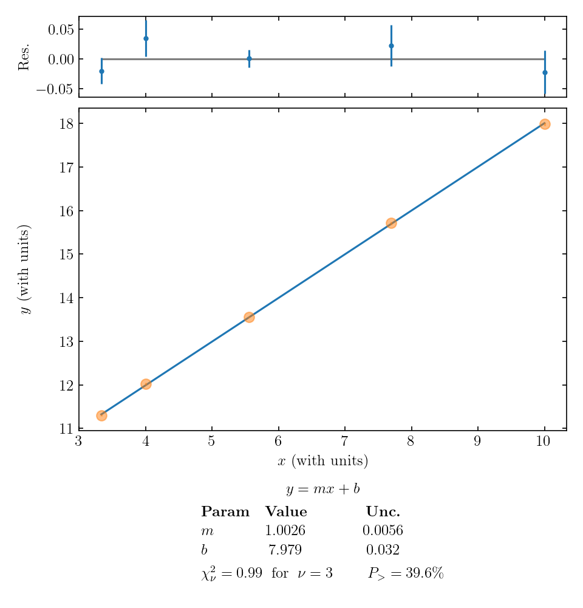
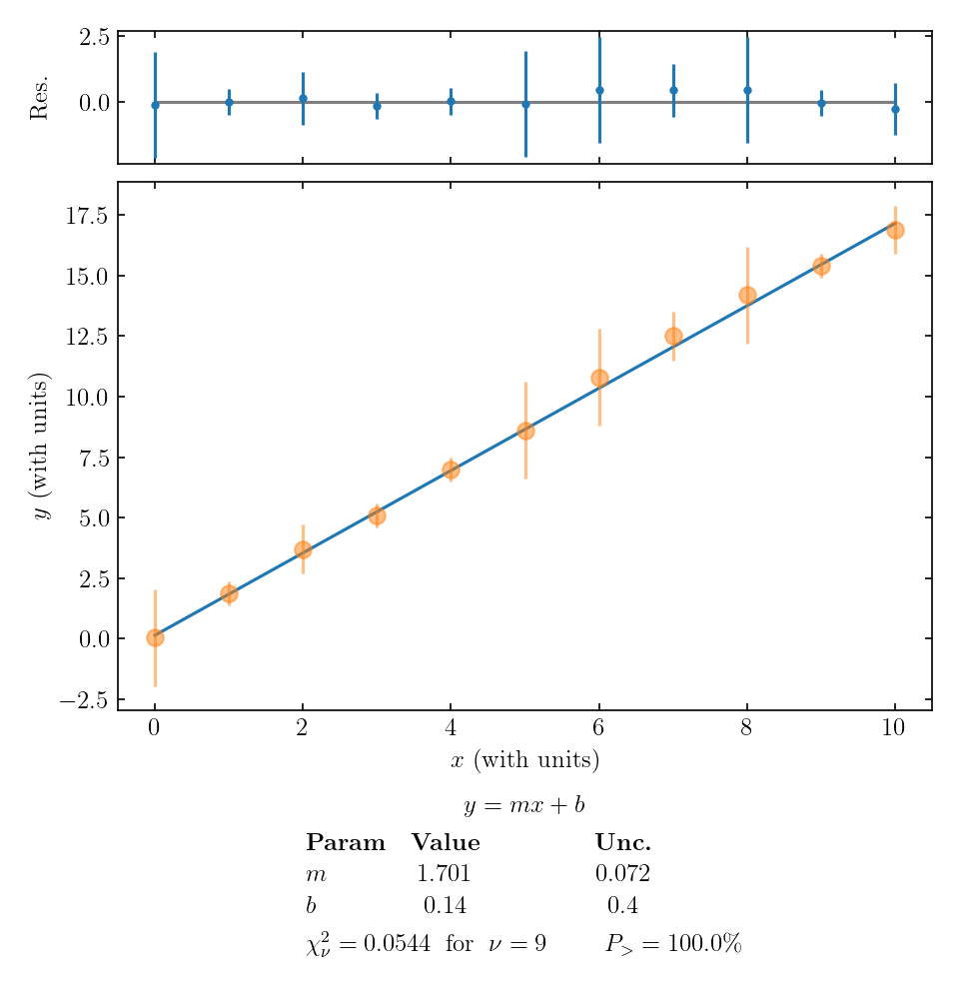
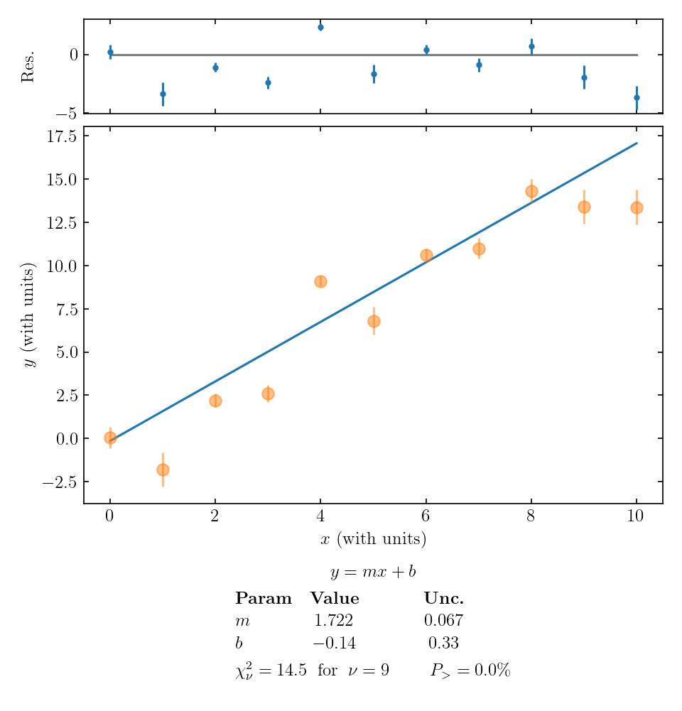

## Interpreting the results of a Least Squares Fit

In our [introduction to plotting](curve-fitting-motivation) we introduced the parameter $$\chi^2$$:

\begin{equation}\label{eq:weighted}
\chi^2 = \underset{m,b}{\mathrm{min}} \sum_{i=1}^{n} \left(\frac{y_i - (mx_i+b)}{\delta y_i}\right)^2
\end{equation}
Here, $$\chi$$ is the Greek letter "chi" (pronounced like ["Kai"](https://www.marketplace.org/2020/10/01/canadas-tourist-driven-pne-pivots-to-hosting-film-production/){:target="_blank"}).

In particular we defined a weighted least squares fit as the linear function that minimized this parameter.

Now that you've performed the fit, the next question is how to interpret the results.

#### 1. Uncertainties in the fitted slope and intercept

The [provided fitting script](https://physics.hmc.edu/fitter/){:target="_blank"} is a weighted curve-fitting script that can fit either a horizontal line whose value is determined by the data, a line in which the slope and intercept are determined by the data, or a quadratic function whose coefficients are determined by the data, depending on the settings. The script also provides an estimate of the uncertainty for each of the fit parameters. The uncertainties of the fit parameters are determined from the error bars and from how scattered the data are about the fit line (or curve in the case of the quadratic fit). 

#### 2. Plot of residuals

In addition to plotting the line or parabola that minimizes $$\chi^2$$, the script outputs a second plot of **_residuals_** above the main graph.  The residuals are the vertical difference between each data point and the fit function; in other words, the residual for the $$i$$th data point is $$y_i - f(x_i)$$.  The residuals are plotted with the same error bars as the original data points.  A residuals plot like this can be particularly useful when the random variations and error bars are too small to see properly on the vertical scale of the main plot.  An example is shown below.

When evaluating the quality of a fit, check that data points typically fall about one error bar away from the curve; if you have a large number of data points, you can check that roughly two-thirds of them are within one error bar of the curve.   Also be on the lookout for any trend or curvature in the pattern of the residuals, which might suggest that your fit function does not match the trends in your data. 

#### 3. Using reduced chi-squared, $$\chi_\nu^2$$, to determine how good your fit is

Also reported below the plot is the "reduced chi-squared", $$\chi_\nu^2$$, which is a normalized version of $$\chi^2$$ from Eq. \eqref{eq:weighted}. The reduced chi-squared is defined by 
\begin{equation}
\chi_\nu^2 = \frac{\chi^2}{\text{num data points -- num fitting parameters}}
\end{equation}

Roughly speaking, the reduced $$\chi^2$$ value tells us on average how many error bars away each data point is from the fitted line. So for example,  $$\chi_\nu^2 = 0.91$$ would mean that *on average* each data point is just within its error bar of the fitted line. This is roughly the result we expect.

(The extra term in the denominator of $$\chi_\nu^2$$ is subtle, and we have ignored it in our rough interpretation of $$\chi_\nu^2$$ above.  If you are curious, the extra term accounts for the fact that any functional form can be made to fit a data set if there are enough numerical parameters to adjust within the fit function. For example, any two points will fit on a single straight line, since the equation for a line has two free parameters (slope and y-intercept).  If we take two data points and fit a straight line to them perfectly, we should not think we have learned anything meaningful about a linear trend in the phenomenon we were investigating!  The extra term in the denominator of $$\chi_\nu^2$$ acts as a kind of caution sign if we _do_ unthinkingly "overfit" our data -- that is, start with a very small number of data points and fit a very complicated function to them.)

**The value of $$\chi_{\nu}^2$$ is important because it can tell us how good our fit is (or sometimes, how well we estimated the error bars).** If the error bars are an accurate representation of the uncertainty in the data, we would expect *on average* each data point to be approximately one error bar away from the line: $$\chi_\nu^2 \approx 1$$. 

#### 4. Using $$P_>$$, to determine how good your fit is

Finally, the fitting script reports a quantity $$P_>$$, given as a percentage.  The meaning of $$P_>$$ is as follows.  Suppose that the phenomenon you are measuring does actually follow the type of trend you fit it to -- constant, linear, or quadratic.  Also suppose that your error bars are an accurate representation of the uncertainty in each data point.  Now suppose that you repeat the entire experiment many times, producing many data sets, plots, and fits.  $$P_>$$ is the fraction of data sets that would give you $$\chi_{\nu}^2$$ value greater than this one just because of random variations in the experimental outcomes.  The calculation of $$P_>$$ starts with the reduced chi-squared value, but it also takes into account the number of data points and number of fit parameters.  With only four points to fit a line, it may not be so unlikely for a particularly unlucky data set to give $$\chi_{\nu}^2>1.1$$, but with 40 or 400 points to fit a line, the same $$\chi_{\nu}^2$$ value is much less likely to come about through simple bad luck, and much more likely to signal a real mismatch between data and theory.

An "ideal" $$\chi_{\nu}^2$$ of 1 corresponds to an "ideal" $$P_>$$ value of 50\%.  That result suggests that your data matches the fit function exactly as well as could be expected on average, given the size of the error bars; this experiment was neither lucky nor unlucky, but exactly in between.  Real data will seldom give this outcome, so it is useful rule of thumb is to look very closely at fits with $$P_>$$ above 90\% or below 10\%, paying attention to the other factors already discussed to decide why the fit is so much "better" or worse than expected.

#### 5. Combining all considerations

In the example above, the value of $$\chi_\nu^2 = 0.99$$ and $$P_> = 39.6\%$$ supports the idea that our linear fit is a good model of the data.  The residuals seem randomly distributed, so that is an added reassurance that a linear function may do a good job of describing the phenomenon we are studying.

Let's look at two examples where our reduced $$\chi^2$$ value differs significantly from 1. First, here's an example where $$\chi_\nu^2$$ is small:

In this example, each data point is much closer than 1 error bar to the fitted line. There are a few ways that a $$\chi_\nu^2 \ll 1$$ can occur: 

+ perhaps it was just a random coincidence that the values lined up, but we have many data points lining up, so that's probably not it; 
+ we overestimated the error bars;
+ the main uncertainty in our experiment is affecting all data points in a correlated way, not scattering individual data points randomly above and below the overall trend.  This is called *correlated* error, most likely arising from some systematic effect that influences all data points in the same direction, but was reset between trials and so contributed to the measured SEM.

The last two options seem the most likely for the above plot. So **if our data looked like this, we should double-check the calculation of uncertainties and give some thought to possible sources of correlated systematic error in the experiment.**

Finally, let's take a look at an example where the data points are typically much further than 1 error bar away from the fitted line:

This large value of $$\chi_\nu^2$$ tells us that:

+ perhaps our model (fitting function) isn't right;
+ perhaps there's a coincidence occurring, but we have many data points not falling on the line so that's probably not the issue;
+ perhaps we underestimated the uncertainties.

The first and third options are both plausible, so we would have to think carefully about how to proceed. If we are sure about our data and reasonably confident in our uncertainty estimate, maybe we need to re-think the theoretical model we are using!  In this particular example, the residuals don't exhibit an obvious pattern, so a simple adjustment to our theory seems unlikely.  If there is a theoretical adjustment, it is something fairly complicated -- or perhaps we have seriously underestimated the size of our random error.

[Return to Data Analysis Main Page](data_analysis_guides) 
-----------
