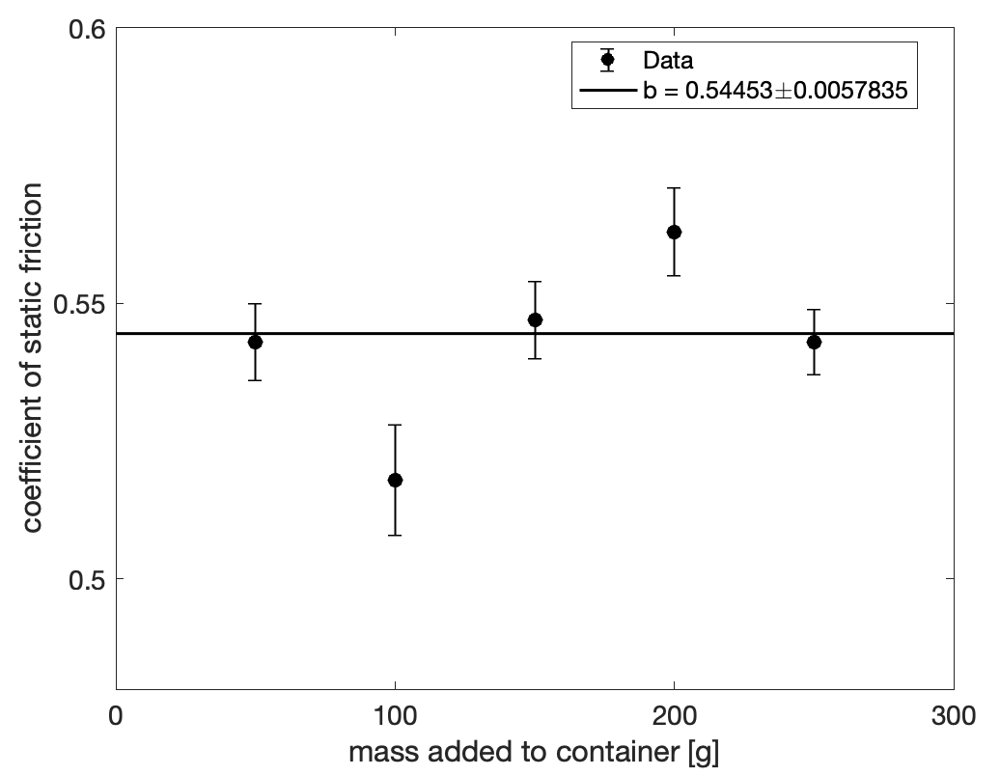

### Fitting a Horizontal Line - MATLAB Code

To use the MATLAB code first make sure you have the "curve fitting toolbox" installed. In the MATLAB environment, go to "HOME"-->"Add-Ons"-->"Get Add-Ons":

and search for the "curve fitting toolbox":

If it says "Installed" you are good to go. Otherwise, click on the Curve Fitting Toolbox page and install it.

Now that you have the curve fitting toolbox, please download the file [curve_fitting_demo_Mod1Week3.m](curve_fitting_demo_Mod1Week3.m) and run the script. 

Every time you run the script, you will get the following warning in the command window:

This warning appears because we aren't providing an initial guess for the fitting parameter, and the function is picking an initial guess randomly. **You can safely ignore this warning.**

To use the script for your own data, simply replace the "import data" section of the code (lines 8-10) with your own data pasted in. **Make sure to report added mass in g.** You shouldn't need to change anything else in the script if you are fitting a horizontal line to your data. The resulting figure should look like the figure below.

You can now directly read off the best fit value of the coefficient of friction $$\mu_s$$, with uncertainty, from the quoted fitting parameter called $$b$$. You will learn in Module 3 how fitting parameters are determined, but for now you are free to just report the value and uncertainty, remembering to follow the [sig fig rules](https://physics-50.github.io/Module-1/week2#reporting-data-with-significant-figures) described earlier in this module. In this example, using the default fake data shown in the figure above, we would find that $$\mu_s = 0.605 \pm 0.017. 

(If you are unsure how the significant figures were determined please follow the link to review the [sig fig rules](https://physics-50.github.io/Module-1/week2#reporting-data-with-significant-figures). Here the leading digit of the uncertainty is a 1 so two digits are kept: 0.017.  Since the uncertainty is quoted to the “thousandths” decimal place the viscosity should also be quoted to the “thousandths” decimal place, so it is quoted as 0.605.) 

NOTE: In the above example data, one data point's error bars do not overlap with the horizontal line. This is actually a good thing - a rule of thumb is that **we should expect the data points to be about one error bar away from the line on average**. We will learn more about this in Module 3.