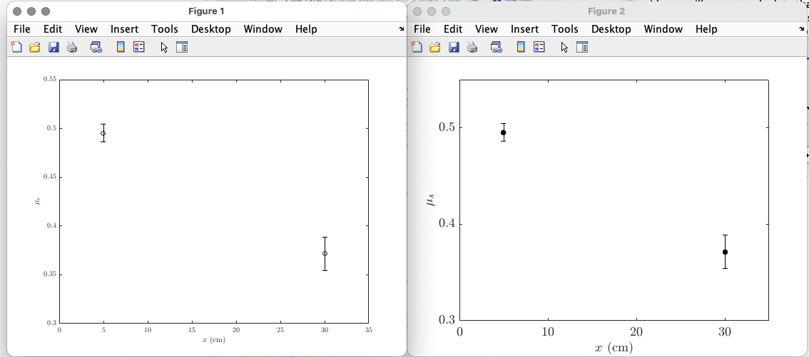
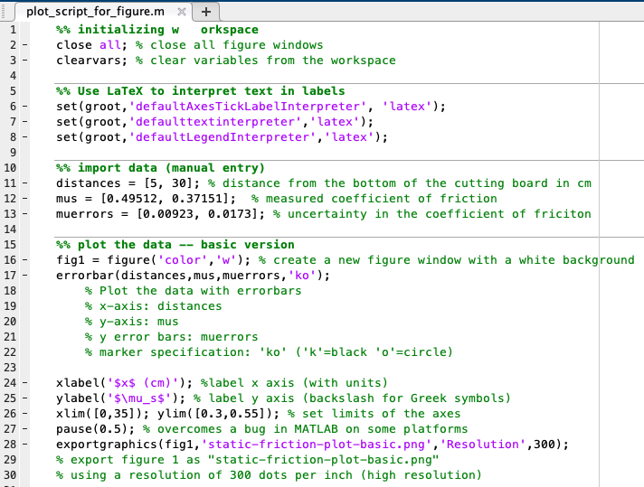
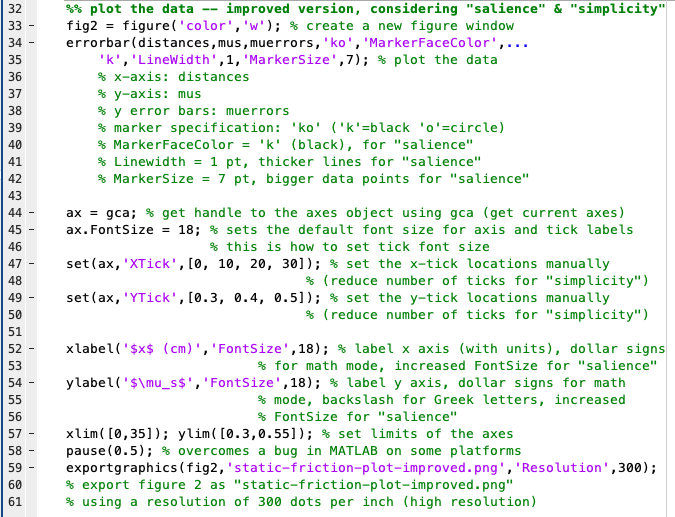
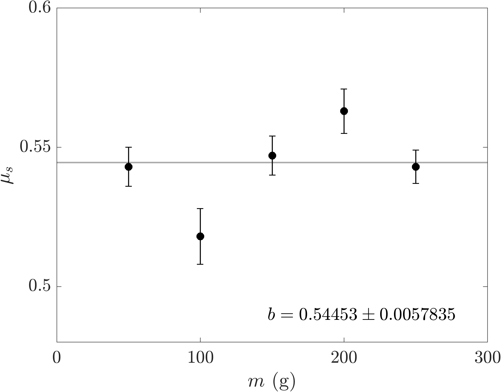

# Guide to plotting and creating a figure for Module 1

In this page, we are going to go through the steps of creating a plot in MATLAB, and then assembling that plot along with a photo of the experiment into a figure. We will use some data from an experiment that was studying the effect of location on the inclined plane (e.g., plank) on the coefficient of static friction. For the purposes of this MATLAB guide, we will use example data that only features two data points, even though you will need to include 5 data points in your plot. Although this is different from the experiment you performed, the following steps are very similar to what you will need to do for your figure.

[Creating a plot in MATLAB](#plotting-with-matlab)

[Assembling the figure in Powerpoint](#assembling-the-figure-in-powerpoint)

## Plotting with MATLAB

Suppose we had the summary data organized in our Google Sheet:


We want to make a plot of $$\mu_s$$ vs the distance from the bottom of the cutting board $$x$$ (with $$\mu_s$$ on the $$y$$ axis). We want to have error bars on the values of $$\mu_s$$ that represent the uncertainty in $$\mu_s$$.

First, we will look at creating a “basic” plot with error bars. Then we will make some aesthetic tweaks to make the plot easier to read.

If you're new to MATLAB, you will want to watch this 5-minute video about [Working in the MATLAB Development Environment](https://www.mathworks.com/support/search.html/videos/working-in-the-development-environment-69021.html?fq=asset_type._name:video%20category:matlab/getting-started-with-matlab&page=1{:target="_blank"}).

And if you've never used a MATLAB “script” before, this 3-minute video gives an overview of [How to Create a MATLAB Script](https://www.mathworks.com/support/search.html/videos/managing-code-in-matlab-scripts-97216.html?fq=asset_type_name:video%20category:matlab/scripts&page=1).


----------
#### Plotting the example data

Now that you have an idea of how to run a MATLAB script, download this [MATLAB script for our example data plotted with error bars](plot_script_for_figure.m){:target="_blank"}. Make sure you save the file into a meaningful directory (e.g. Ph50/Module1). If you open the script and run it in MATLAB, two figures should pop up (one might be behind the other) that are two versions of the same plot:

[*Click here to open image in new tab*
](images/fig-windows.png){:target="_blank"}

*Note: the font sizes in your plots may be different than the ones shown here.*

Before we dig into the details of the MATLAB code, can you spot the differences between the two plots?

The right-hand figure requires more lines of code to produce, but most people find it easier to read and interpret. The right-hand figure was generated with the principles of “salience” and “simplicity” in mind:

**“Salience”** means that an object stands out from other objects around it. When making a figure, we should aim to make the most relevant/important objects the ones with the most salience. In the case of the plot above, the right-hand plot has the data points with filled-in circles and thicker lines, which makes those data points stand out. Because the relative location of the two data points and the size of the error bars is the relevant information needed to make a conclusion, we want to make them stand out (give them salience). The font size of the axis labels was also increased on the right-hand plot which make the labels easier to read. Remember that we are going to create a two-panel figure for the Module 1 deliverable, so we need to make sure the fonts are still readable when we scale the plot down in size.

**“Simplicity”** means eliminating irrelevant and visually distracting information. In the case of the plots above, the right hand plot has fewer tick labels than the left plot. Fewer tick labels makes the plot look cleaner and less cluttered. Notice the $$x$$ axis of the left-hand plot has tick marks at {0,5,10,15,20,25,30} cm but the right hand plot only has them at {0,10,20,30} cm. We don’t lose our ability to see the value of the data points with fewer tick marks.

Salience and simplicity are further [explained here with another example in MATLAB (optional)](https://bacteriophysics.web.illinois.edu/wp/wp-content/uploads/2019/02/figure-guide-ls-2016.pdf#page=4){:target="_blank"}.

For our plotting guide here, let’s follow this plan:

1. understand the “Basic” version of the plotting with error bars script (that generated the left-hand plot)

2. understand the “Improved” version of the plotting script (that generated the right-hand plot)

### “Basic” Plotting in MATLAB with error bars

Let’s dissect the plotting script you already downloaded [plot_script_for_figure.m](plot_script_for_figure.m){:target="_blank"}. The relevant lines of code are on lines 1–30.

[*Click here to open image in new tab*
](images/basic-plot-script.png){:target="_blank"}

Reminder: the “%” symbols are comments in MATLAB.

#### Initializing the MATLAB Workspace [lines 1-3]
If you’re running a script multiple times, it’s generally a good idea to reset things first. This includes automatically closing figures and clearing any variables from the workspace that might be previously defined.

#### Set MATLAB to use LaTeX for text [lines 5–8]
To produce a graph with uniform fonts for both text and mathematical symbols, we will use the LaTeX interpreter for all text. To set a symbol in math mode, you surround it with dollar signs. For example, Einstein’s famous equation would be typed $E = mc^2$.

#### Import Data (manual entry) [lines 10-13]
Next we need to import the data from our Google Sheet. Since we only have a couple of data points, it’s fastest just to copy-paste them into our script manually. Another option if we had more data would be to download the Google Sheet as an Excel file or comma-separated-values (csv) file, and then use the “Import Data” button in MATLAB. But let’s keep things simple here and copy-paste the data manually.

#### Plot the Data -- “basic” version [lines 15-30]
Now that we have the data imported into MATLAB, we can plot it. We will use the “errorbar” function in MATLAB (don’t forget that you can “Search Documentation” near the top-right of the MATLAB Development Environment for help on any function!):

“errorbar(X,Y,E) plots Y versus X with symmetric error bars 2*E(i) long. X, Y, E must be the same size. Each error bar is a distance of E(i) above and below the point defined by (X(i),Y(i)).”

The plotting_script_for_figure.m uses errorbar on line 17:
``` MATLAB
errorbar(distances,mus,muerrors,'ko');
```
where the 'ko' plots the data points as a black circle (k=black, o=circle).

Other important pieces in the code are setting the axes labels (lines 24-25), setting the range of the plot to zoom in on the data (line 26), and saving the plot as a high-resolution png image (line 28). This should save the file "static-friction-plot-basic.png":


### Improved plot (easier to read)

The code for the improved plot with error bars is on lines 32-61 of [plot_script_for_figure.m](plot_script_for_figure.m){:target="_blank"}.

[*Click here to open image in new tab*
](images/improved-plot-script.png){:target="_blank"}

To make the important parts stand out and the plot more readable, we add the following:

+ filling-in the data points by setting the 'MarkerFaceColor' to black, increasing the 'LineWidth' to 1 pt, and increasing the 'MarkerSize' to 7 pt (lines 34–35)
``` MATLAB
errorbar(distances,mus,muerrors,'ko','MarkerFaceColor',...
    'k','LineWidth',1,'MarkerSize',7); % plot the data
```
MATLAB uses three dots at the end of a line to indicate that the statement continues on the next line.

+ increasing font size to 18 pt for tick labels, and reducing the number of tick marks (lines 44-50)
``` MATLAB
ax = gca; % get handle to the axes object using gca (get current axes)
ax.FontSize = 18; % sets the default font size for axis and tick labels
                  % this is how to set tick font size
set(ax,'XTick',[0, 10, 20, 30]); % set the x-tick locations manually
                              % (reduce number of ticks for "simplicity")
set(ax,'YTick',[0.3, 0.4, 0.5]); % set the y-tick locations manually
                              % (reduce number of ticks for "simplicity")
```

+ creating axis labels, and setting their font size to 18 pt (line 52-56)
``` MATLAB
xlabel('$x$ (cm)','FontSize',18); % label x axis (with units), dollar signs
                        % for math mode, increased FontSize for "salience"
ylabel('$\mu_s$','FontSize',18); % label y axis, dollar signs for math
                        % mode, backslash for Greek letters, increased
                        % FontSize for "salience"
```

The script saves the result as a png image "static-friction-plot-improved.png" (line 59):


**Important: Now that you understand some ways to customize your plot in MATLAB, you can delete the code for the “Basic” version (lines 15-30). You will need to alter the remaining code for plotting your data. You will need to import your own data, and you might also need to tweak some of the improvements. If you can’t see your data points, then check that your data points fall within the “xlim” and “ylim” you are using.**

[Return to Module 1, Week 3](week3#plotting-your-data)

<!-- I think the following really belongs elsewhere, but I will edit in this file
assuming that it can be moved later. -->

### Fitting a Horizontal Line - MATLAB Code

To use the MATLAB code first make sure you have the “curve fitting toolbox” and the “statistics and machine learning toolbox” installed. In the MATLAB environment, go to **HOME** ==> **Add-Ons** ==> **Get Add-Ons**:


and search for both the “curve fitting toolbox” and the “statistics and machine learning toolbox”:


If both are “Installed” you are good to go. Otherwise, click to install either or both.

----
Now download the file [fitting_Mod1Week3.m](fitting_Mod1Week3.m) and run the script.

Every time you run the script, you will get the following warning in the command window:


This warning appears because we aren't providing an initial guess for the fitting parameter, and the function is picking an initial guess randomly. **You can safely ignore this warning.**

To use the script for your own data, simply replace the “import data” section of the code (lines 8-10) with your own data pasted in. **Make sure to report added mass in g.** You shouldn’t need to change anything else in the script if you are fitting a horizontal line to your data. The resulting figure should look like the figure below.



You can now directly read off the best fit value of the coefficient of friction $$\mu_s$$, with uncertainty, from the quoted fitting parameter called $$b$$. You will learn in Module 3 how fitting parameters are determined, but for now you are free to just report the value and uncertainty, remembering to follow the [sig fig rules](https://physics-50.github.io/Module-1/week2#reporting-data-with-significant-figures) described earlier in this module. In this example, using the default fake data shown in the figure above, we would find that $$\mu_s = 0.545 \pm 0.006$$.

(If you are unsure how the significant figures were determined please follow the link to review the [sig fig rules](https://physics-50.github.io/Module-1/week2#reporting-data-with-significant-figures).
NOTE: In the above example data, one data point's error bars do not overlap with the horizontal line. This is actually a good thing — a rule of thumb is that **we should expect the data points to be about one error bar away from the line on average**. We will learn more about this in Module 3.

## Assembling the figure in Powerpoint
To create your two-panel figure for the Module 1 deliverable, we recommend using Powerpoint to assemble the parts. If you don't have Powerpoint installed, you can [get it free from HMC CIS here](https://www.hmc.edu/cis/services/office-365-education-for-students/).


Open a new Powerpoint presentation and insert both the images you have made (the plot you've created and a photo of your setup).

For a scale bar, you will need to measure the length of a reference object (e.g., in real life, the tuna can is 8.5 cm in diameter). Then you can Insert->Shapes->Line in Powerpoint and make a scale bar of an appropriate size.

Insert text boxes to label the panels (a) and (b).


Then insert a text box for the caption, as discussed <where?>.
When you’re satisfied with how the figure looks, select all of the objects on the slide, right click and “Save As Picture”. You now have a saved figure file (save as either .png or .jpg for Gradescope submission please).
